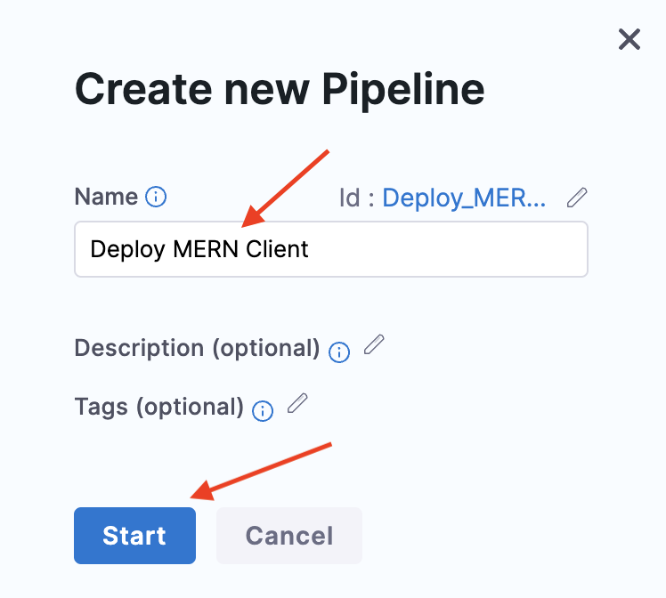
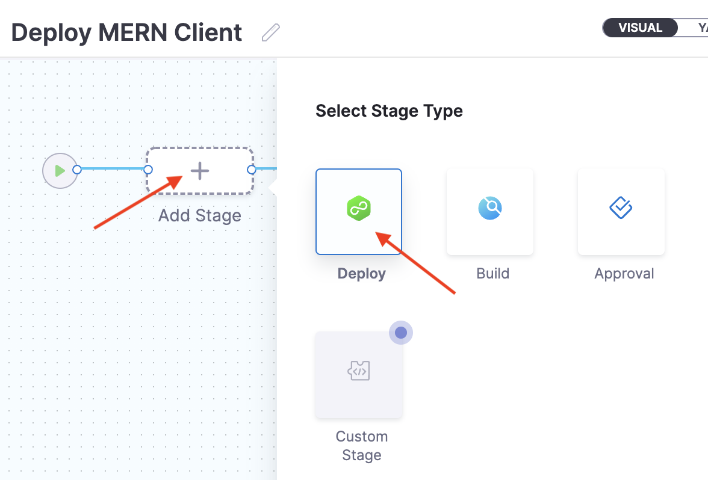
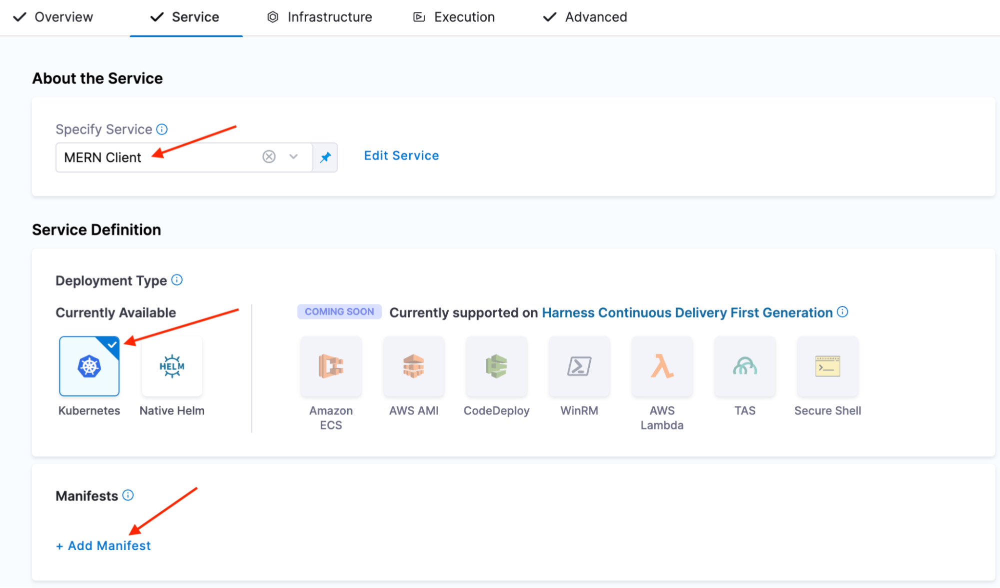
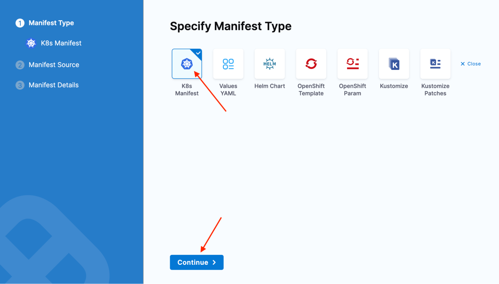
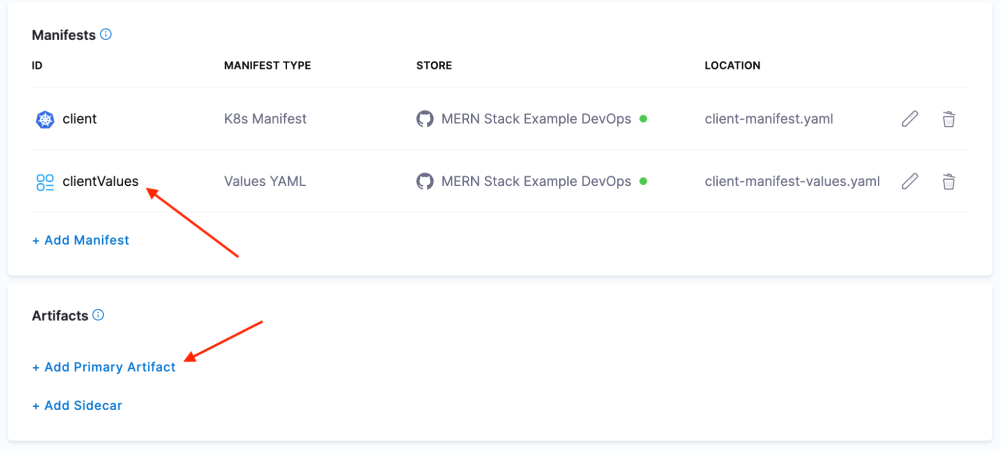
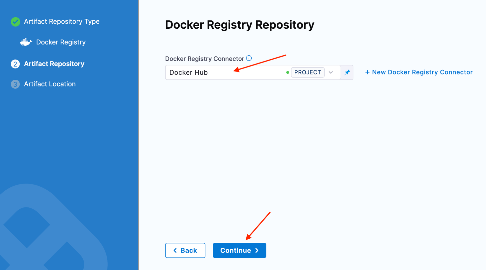
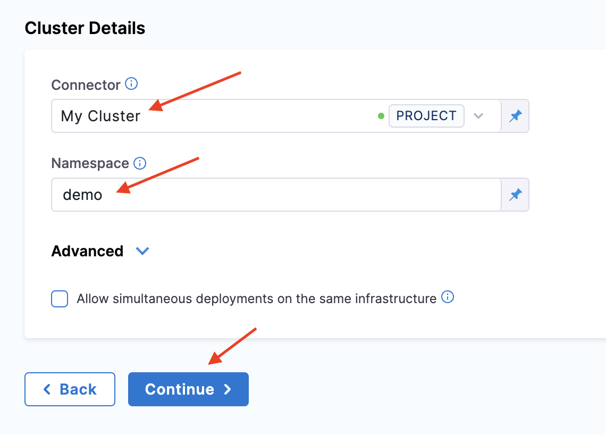
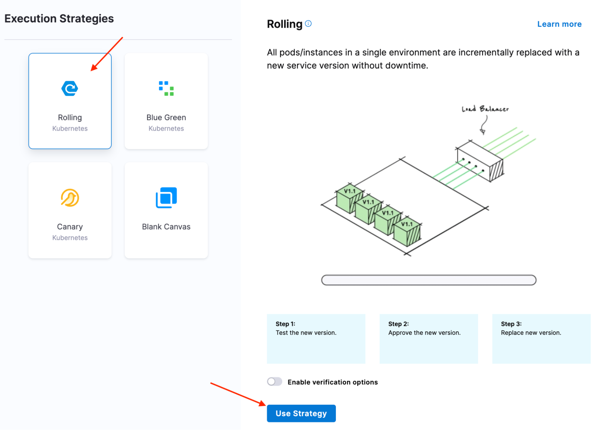
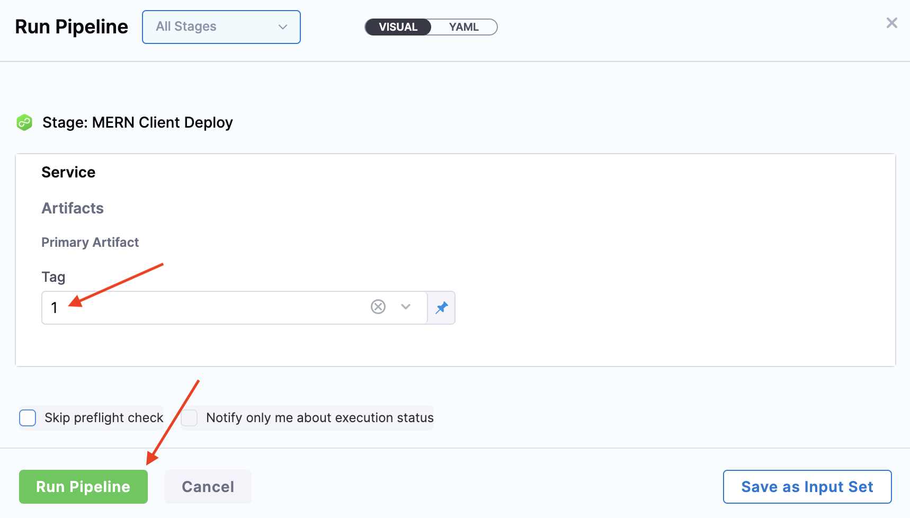

Open Harness Cd and click New Pipeline.


Enter "Deploy MERN Client" in the *name* field, then click *Start*.



Click **Add Stage**, then select **Deploy**.



Enter “MERN Client” in the **Stage Name** field.

Ensure you selected **Service** is selected under **What would you like to deploy?**. Then click **Set Up Stage**.


#### Client Manifest

Select **MERN Client** from the **Specify Service** drop-down menu.

Select **Kubernetes** for the **Deployment Type**, then click **Add Manifest**.



Select **K8s Manifest**, then click **Continue.**



Select **GitHub**, then click **Select GitHub Connector**.


Select **MERN Stack Example GitOps**, then click **Apply Selected**.


Check the **GitHub Connector **field. Make sure that you selected the **MERN Stack Example GitOps**.


Enter “client” in the **Manifest Identifier** field.

Select **Latest from Branch** in the **Git Fetch Type** field.

Enter “main” in the **Branch** field.

Enter “client-manifest.yaml” in the **File/Folder Path** field, then click **Submit**.


#### Client Manifest Values

Verify that the **client** entry appears in the manifest list, then click **Add Manifest**.


Select **Values YAML**, then click **Continue**.


Select **GitHub**, then click **Select GitHub Connector**.


Select **MERN Stack Example GitOps**, then click **Apply Selected**.


Verify that **MERN Stack Example GitOps** appears in the **GitHub Connector** field. Then click **Continue**.


Enter “clientValues” in the **Manifest Identifier** field.

Select **Latest from Branch** in the **Git Fetch Type** field.

Enter “main” in the **Branch** field.

Enter “client-manifest-values.yaml” in the **File/Folder Path** field, then click **Submit**.


#### Client Artifact

Verify that **clientValues** appears in the manifest list, then click **Add Primary Artifact**.



Click **Docker Registry**, then click **Continue**.


Click **Select Docker Registry Connector**.


Select **Docker Hub**, then click **Apply Selected**.


Verify that **Docker Hub** appears in the **Docker Registry Connector** field. Then click **Continue**.



Enter “dockerusername/mern-client” in the **Image Path** field. Where “dockerusername” is your Docker Hub username. Then click **Submit**.


Verify that **mern-client** appears in the artifact list, then click **Continue**.


Select **demo** from the drop-down menu in the **Specify Environment** field.

Select **Kubernetes** for **Infrastructure Definition**. Then click **Select Connector**.


Select **My Cluster**, then click **Apply Selected**.


Verify that **My Cluster** appears in the **Connector** field.

Enter “demo” in the **Namespace** field, then click **Continue**.



Select the **Rolling**, then click **Use Strategy**.



### Run Pipeline

Click **Save**.


Click **Run**.


Captain Canary again. This next bit of instruction is going to require your help. You see, to complete this step the Client CI process must have successfully run. You’ll need to know the build number for the last successful client CI pipeline. If you followed along with our CI getting started guide, (and if my minions haven’t broken the client codebase), this should almost always be 1. I like to push buttons because they're there. So I may have re-run that CI pipeline a few times. If you’ve run that pipeline multiple times for grins and giggles pick a good client CI pipeline execution tag. That said, Select the appropriate tag from the drop-down menu in the **Tag** field, then click **Run Pipeline**.



Wait for the deployment to complete successfully.


Run `kubectl` to retrieve the external IP of the MERN Client. In this example, the external IP is `34.148.210.10`, **_<span style="text-decoration:underline;">yours will be different.</span>_**

```
$ kubectl --namespace demo get service/client
NAME     TYPE           CLUSTER-IP     EXTERNAL-IP     PORT(S)        AGE
client   LoadBalancer   10.108.0.164   34.148.210.10   80:32552/TCP   10m
```

Hey, Captain Canary again. Check out that external-IP. Copy and paste it into your browser window, and boom! Bob's your uncle. Welcome to our MERN Stack Example. This is exciting. I’m all a flutter. You’ve built a Continuous Deployment pipeline! You've used it to deploy this fantastic app to your own Kubernetes Cluster. I mean this is like having your cake and eating it too.

While we’re here, let me walk you through this **_life changing_** application. 

You should see something like this: 


Up there in the top right is the magic button. Clicking it takes you to a page where you can click _yet another button_ to create a new record. Yeah, the _Redundant committee on redundancy brought you that UI._

When you click that second button, it will simply record the current Date/Time and log your IP address. 

Like I said, **_Life Changing_**. 

But that’s not all you can do with this example. You can also interact with the Kubernetes pod that was deployed by Harness CD. This gives you access to logs, for instance. Here’s how:

In your terminal, execute:

```
kubectl get pods -n demo
```

Which should give you something like this:

```
NAME                                 READY   STATUS             RESTARTS   AGE
restaurant-server-7975fc6fd9-k2kkf   0/1     CrashLoopBackOff   3554       13d
```

Yep, my pod is struggling. Sigh. Minions. 

Anyway, what’s important to note here is the _name_ of your pod. You’re gonna need that. With that name in your copy/paste buffer, execute this:

```
kubectl logs -n demo <<PASTE YOUR POD NAME HERE>>
```

I'm going to assume you've visited the application in your browser. You did do that, right? If so, you should see some logs like this:

```
{"level":30,"time":1656447497424,"pid":1,"hostname":"restaurant-server-7975fc6fd9-k2kkf","msg":"Server listening at http://0.0.0.0:5001"}
```

You may see *more* logs, but you should at least see that much!               As    

If  don’t know about you, but  I think this is simply stellar. I want to thank you for working through this with me. We’ve now completed this CD getting started guide and I have two parting things to leave you: 

1. Remember, tweet @Capt_Canary with any questions, comments and snide remarks. 
2. You’re awesome. Keep that up.